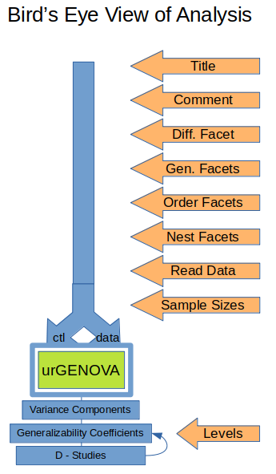

[Return](professionals.md)
## Analysis, the Bird's Eye View ##
<TABLE>
	<TR>
		<TD width = "50%">
			
		</TD>
		<TD width = "50%">
			This Bird's eye view is important for IT professionals, in order to
			understand the code of <a href="https://github.com/G-String-Legacy/G_String/blob/main/workbench/GS_L/src/steps/AnaGroups.java">'AnaGroups.java'</a>.  
			The first part of the step-by-Step workflow is straightforward.
			It eventually leads to GS creating two files, a control file '~control.txt',
			and a data file '~data.txt', both of which are placed into the working directory,
			where urGENOVA is activated to produce an output file '~control.txt.lis'.  
			The control file can be saved as 'script', which then can be re-used as alternative to manual entry of parameters.  
			GS picks up the urGENOVA output file, copies the content to its own collective
			output, and interprets it. Specifically, it extracts the configurations and values of the
			individual variance components, and uses them to calculate &sigma;2(&tau;),
			&sigma;2(&delta;), and &sigma;2(&Delta;).  
			From these it calculates &Phi;, and E&rho;2, the generalizability coefficients.
</TABLE>

[Next](VarianceComponents.md)
