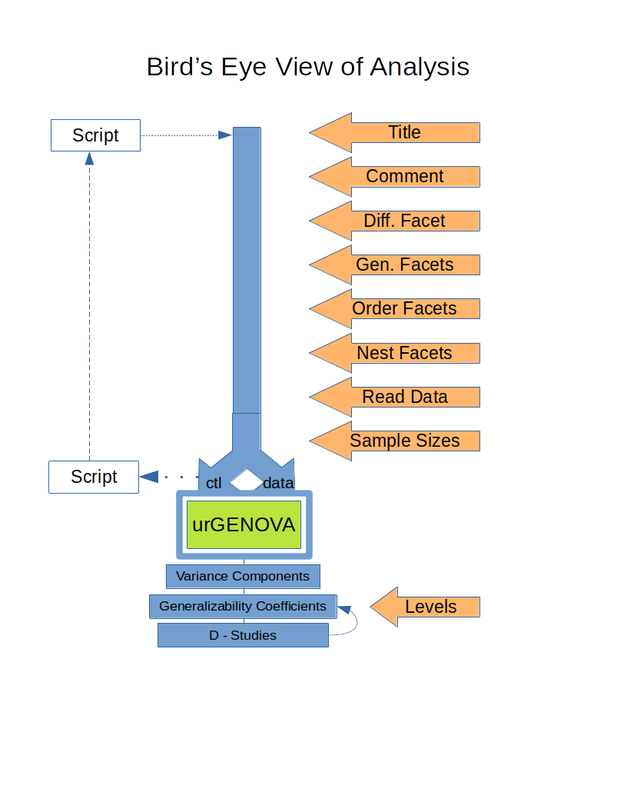

[Return](professionals.md)
## Analysis, the Bird's Eye View ##
<TABLE>
	<TR>
		<TD>
			
		</TD>
		<TD>
			This Bird's eye view is important for IT professionals, in order to
			understand the code.  
			The first part of the step-by-Step workflow is straightforward.
			It eventually leads to GS creating two files, a control file '~control.txt',
			and a data file '~data.txt', both of which are placed into the working directory,
			where urGENOVA is activated to produce an output file '~control.txt.lis'.  
			
</TABLE>
