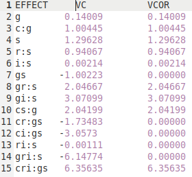

[Return](professionals.md)
## Calculating Coefficients ##
#### Continuing with the previous example: ####
<table><tr><td width = "40%"></td><td>
Let us start by defining a few variables, we are going to need for our calculations. We have 14 different effects in this example. <UL>
<LI>'Ee' will stand for an effect, where 'e' is an index 0..13. </LI>
<LI>'Ve' stands for the corresponding corrected variance components 'VCOR' in the table.</LI>
<LI>'f' stands as index for the five facets Ff (f = 0..4).</LI>
<LI>B&kappa;(E) is a bit like a boolean, it takes on the values 0 or 1 depending on the subscript &kappa; (to be defined below), and the facets within E.</LI>
<LI>Af is the 'average' sample size for Ff (to be defined below).</LI>
</UL>
</td></tr></table>
<table><tr><td width = "60%">
We classify facets thus:<ul>
<li>'facet of differentiation (d)':  the primary subject of interest;</li>
<li>'facets of generalization (g)':  components of the measurement process;</li>
<li>'facets of stratification (s)':  categories of primary subjects.</li></ul> 
<b>Brennan's Rules</b>
(<a href="../workbench/GS_L/src/utilities/VarianceComponent.java#L162">code</a>) for B&kappa;(E) state, that if effect E contains:<ul>
<li>a 'd', but no 'g' facet, B&tau;(E) = 1, otherwise 0;</li>
<li>a 'd', and at least one 'g' facet, B&delta;(E) = 1, otherwise 0;</li>
<li>at least one 'g' facet, B&Delta;(E) = 1, otherwise 0.</li></ul> 
<b>Brennan's Rules</b> for Af state that if the facet Ff is:<ul>
<li>a 'd' or 's' facet, Af = 1.0;</li>
<li>a crossed 'g' facet, Af = the sample size of that facet;</li>
<li>a 'g' facet, nested once, Af = the arithmetic mean of sample sizes;</li>
<li>a 'g' facet, nested deeper, Af = the harmonic mean of sample sizes;</li></ul>
</td><td> (see Brennan, Generalizability Theory, 2001; p. 122)  
<!-- $$
\sigma^{2}(\kappa) = \sum\limits_{e}\frac{B_{\kappa}(E_{e})\times V_{e}}{\prod\limits_{F_{f}\;\in\;E_{e}}A_{f}}
$$ --> 

Where &kappa; can be one of &tau;, &delta;, or &Delta;  
<b>Generalizability coefficient</b?>: 
<!-- $$
E\rho^2 = \frac{\sigma^2(\tau)}{\sigma^2(\tau)+ \sigma^2(\delta)}
$$ --> 

<b>Index of dependability</b>:
<!-- $$
\Phi = \frac{\sigma^2(\tau)}{\sigma^2(\tau)+ \sigma^2(\Delta)}
$$ --> 

  </b><a href="../workbench/GS_L/src/model/Nest.java#L566">(code)</a>

 </td></tr></table>
 
[Next](D_Study.md)
