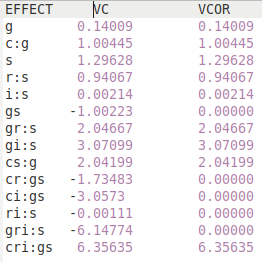

[Return](professionals.md)
## Calculating Coefficients ##
<table><tr><td width = "40%"></td><td>
Let us start by defining a few variables, we are going to need for our calculations. We have 14 different effects in this example. We will call them 'Ee', where 'e' is an index 0..13. 'Ve' stands for the corrected cariance components 'VCOR' in the table.
</td></tr></table>