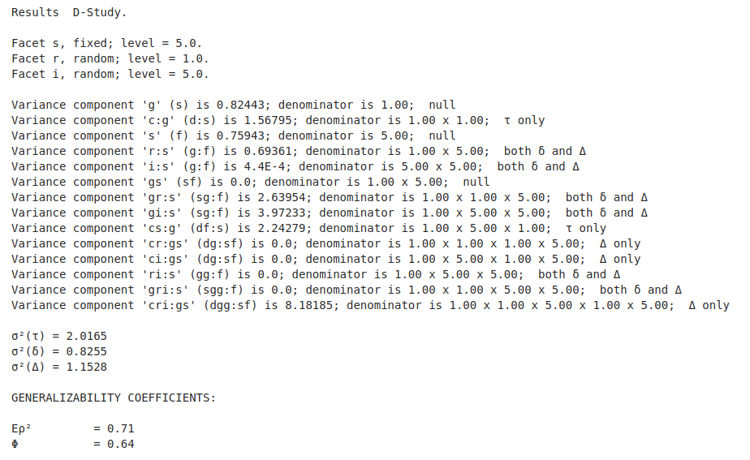

[Return](professionals.md)
## D-Studies ##
The formulae we showed in the 'Coefficients' page apply to so called G-Studies; where we estimate the variance components of the various direct and crossed effects from actual observed models in order to calculate the generalizability coefficients as measures of reliability of the data.  
But Generalizability Theory offers yet another opportunity: a method of improving assessment tools using variance components from earlier or trial data sets. This approach is called 'D-Studies'. It allows users trying different sample sizes for facets of generalisation, and/or making them identical to the facets found in the original example (fixed facets). This leads us from Random Effect to Mixed Effect ANOVA, i.e. it considers both random and fixed effects.

Like G-Studies, D-Studies are handled by method <a href = "../workbench/GS_L/src/steps/AnaGroups.java#L1129">''Analysis'</a>. But via <a href = "../workbench/GS_L/src/utilities/FacetModView.java">'FacetModView'</a> the user can change facet type and average sample size.

<table><tr><td width = "60%">
We classify facets thus:<ul>
<li>'facet of differentiation (d)':  the primary subject of interest;</li>
<li>'random facets of generalization (g)';</li>
<li>'fixed facets of generalization (f)',  i.e. identical to the model;</li>
<li>'facets of stratification (s)':  categories of primary subjects.</li></ul>
Brennan's Rules need to be only minimally adjusted in that the rules still apply to random facets of generalization, but ignore the fixed facets of generalization. And sample sizes are no longer calculated through an averaging process, but are entered by the user. 
<b>Brennan's Rules</b> for B&kappa;(E) state, that if effect E contains:<ul>
<li>a 'd', but no 'g' or 'f' facets, B&tau;(E) = 1, otherwise 0;</li>
<li>a 'd', and a least one 'g' (is random) facet, B&delta;(E) = 1, otherwise 0;</li>
<li>at least one 'g' facet, B&Delta;(E) = 1, otherwise 0.</li></ul>
<b>Brennan's Rules</b> for Af require that if the facet Ff is:<ul>
<li>a 'd' or 's' facet, Af = 1.0;</li>
<li>for all other facets Af is equal to the manually entered sample size.</li>
</ul>
</td><td> 
<!-- $$
\sigma^{2}(\kappa) = \sum\limits_{e}\frac{B_{\kappa}(E_{e})\times V_{e}}{\prod\limits_{F_{f}\;\in\;E_{e}}A_{f}}
$$ --> 

Where &kappa; can be one of &tau;, &delta;, or &Delta;  
<b>Generalizability coefficient</b?>: 
<!-- $$
E\rho^2 = \frac{\sigma^2(\tau)}{\sigma^2(\tau)+ \sigma^2(\delta)}
$$ --> 

<b>Index of dependability</b>:
<!-- $$
\Phi = \frac{\sigma^2(\tau)}{\sigma^2(\tau)+ \sigma^2(\Delta)}
$$ --> 

 </td></tr></table>
 
 ### D-Study Results ###

[Next](Signature.md)
