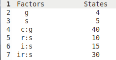
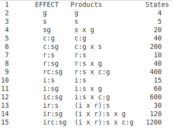

[Return](professionals.md)

## Constructing the Effects ##
The list of 14 effects that we saw in Analysis were provided by urGENOVA, based on the five primary effects, we had entered in step 6. In fact, the first five effects are the same; the other 9 result from crossing the primary effects, constrained by the nesting. We will illustrate the synthesis algorithms, using the same model.  
In Synthesis we have to figure out these crossed effects ourselves. G_String uses an amazingly simple algorithm that consists of four steps:
### 1. Find all possible combinations of the facets ###
Combinatorics teaches us that n items  can be combined in N ways, ignoring ordering, and requiring at least one item: $$N = 2^{n}-1$$ Expressing the numbers from 1 to N in binary form requires 'n' digits, each being either '0' or '1'. Associating each position of the binary number with a specific facet, then gives us all possible combinations of the 'n' facets.
### 2. Eliminate all combinations that violate nesting rules ###
But not all N combinations meet the nesting constraints. In fact, a given facet can only occur in the combination, if all the facets, it is nested in, also appear in the Effect. We have to eliminate all effects, where a nested facet ('Nestee') appears without its immediate container facet ('Nestor'). This happens in 'CombConstr'.
### 3. Break Effects into Factors ###
<table><tr><td width = "50%">
Before we can calculate the number of states, each Effect can assume, we have to break down the Effects
into Factors, where the number of states ('size') is determined easily.
</td><td></td></tr></table>

### 4. States of Effects ###
<table><tr><td width = "50%">
By 'number of States' we mean the number of ANOVA error terms &epsilon; required for a given Effect considering the respective sample sizes. This number is calculated for each Effect as the product of sizes of its constituent Factors.
 
</td><td></tr></table>

[Next](Synthesize.md)
