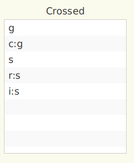

[Return](Variance.md)
## Partitioning the Variance ##
There are two steps to partition the data variance into its components:
1.	Identifying how the variance has to be partitioned, and
2. Calculating the numerical value of these partitions.

### Identifying Variance Components ###
Rather than starting off with a theoretical explanation, let's look at a very simple example: 

The simplest possible design is 2 crossed facets: e.g. short essay, student (signature 's') x question (signature 'q'). All essays are being marked blindly on a 5 point scale. In this case we will have a total of 3 variance components: 1 component each for the facets 's' and 'q', plus 1 facet for the interaction of these two ('sq'). In fact, in this very simple design the component 'sq' is also considered the 'residual variance component', encompassing all possible residual confounders.

We will discuss some more complex designs in greater detail below. But the general rule for listing all possible variance components for n facets is:
> All allowed combinations of facets = 2n - 1 - all combinations violating nesting rules.

The nesting rules require that a combination is only allowed, if for every listed facet, all the facets, in which it is nested, are included as well in the combination.
### Calculating their Numerical Values ###
In this ridiculously simple example, the variance components can be calculated directly from the raw scores. In the more general case, however, iterative approximations are required to arrive at the variance component values. G_String is using a subroutine (urGENOVA) designed by Robert Brennan[^1] to calculate these values. The code is based on an algorithm developed by C.R. Henderson[^2].

### Finally - the G-Coefficients ###
The G_String output for a synthetic dataset simulating the s x q design looks like [this](Results_s_x_q.txt). G_String calculates E&rho;2, the relative variance fraction due to students as:

and the absolute variance fraction due to students:

In other words, the results affirm that we can rely this study.

That leaves us with [understanding &sigma;2(&tau;), &sigma;2(&delta;), and &sigma;2(&Delta;)](sigmas.md), as well as, how to calculate them.

### With 'Nesting' it is the same, only more so! ###
For example, let us take a typical OSCE design with four groups (g) of ten candidates (c) each. The parcours consists of five stations (s), each with two raters (r) marking on three items (i). The G_String design looks such:

 
This design gives rise to many more configurations. But don't worry, you won't have to figure them all out by yourself. G_String will do it for you:

The final G_String result output tells you, among other:

> Variance component 'c:g' (d:s) is 1.00445; 
> denominator is 1.00 x 4.00;  
> τ only 

*That means explicitly that the variance component for the configuration 'candidate nested in group', which is the facet of differentiation nested in a facet of stratification, is equal to 1.00445.  This value has to be divided by (1.0 x 4.0). The result is &sigma;2(&tau;).*

and:
> Variance component 'cs:g' (dg:s) is 2.04199; 
> denominator is 1.00 x 5.00 x 4.00;  
> both δ and Δ

*Explicitly: the variance component for the configuration 'station times candidate nested in group', which is the facet of differentiation nested in a facet of stratification times a facet of generalisation, is equal to 2.04199.  This value has to be divided by (1.0 x 5.0 x 4.0). The result goes both into &sigma;2(&delta;) and &sigma;2(&Delta;).*

[^1]:R.L. Brennan. Manual for urGENOVA. Iowa City, IA: Iowa Testing Programs, University of Iowa, based on an algorithm developed by C.R. Henderson.

[^2]:C. R. Henderson. Estimation of Variance and Covariance Components. Biometrics Vol. 9, No. 2 (Jun., 1953), pp. 226-252
