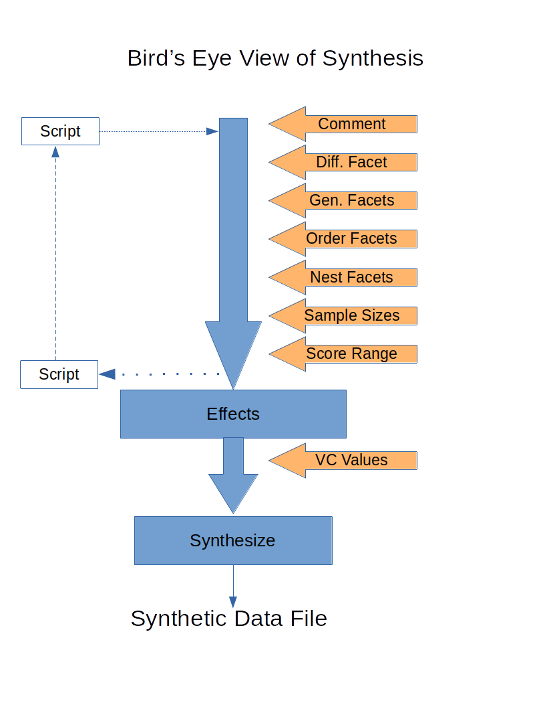

[Return](professionals.md)
## Synthesis, the Bird's Eye View ##
<TABLE>
	<TR>
		<TD width = "50%">
			
		</TD>
		<TD width = "50%">
			This Bird's eye view is important for IT professionals, in order to
			understand the code of <a href="https://github.com/G-String-Legacy/G_String/blob/main/workbench/GS_L/src/steps/SynthGroups.java">'SynthGroups.java'</a>.  
			The first part of the step-by-Step workflow is straightforward. 
			Based on these design parameters, GS generates the permitted Effects corresponding to the different 'Variance Components', and presents them to the user, who then enters the estimated 'Variance Component' values for each Effect.  
			The control file can be saved as 'script', which then can be re-used as alternative to manual entry of parameters. GS then generates the synthetic data file based on these parameters, 
			and stores the results as a properly formated GS data file.
		</TD>
	</TR>
</TABLE>

[Next](Effects.md)
