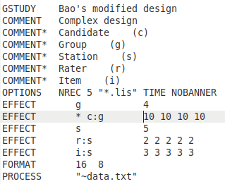
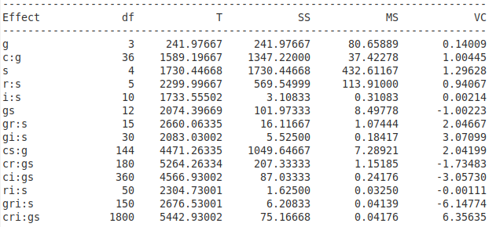

[Return](professionals.md)
## Variance Components in Analysis ##
<table><tr><td width = "45%"></td><td>
For Analysis, the step-by-step workflow leads the user to enter all the data required by Brennan's 'urGENOVA', and formats them in a specific way. We are using here a virtual example, based on a design by Le Quoc Bao from the <i>Center for Advanced Training in Clinical Simulation, University of Medicine and Pharmacy</i> at Ho Chi Minh City, Vietnam. 
It first sets a header, followed by a list of comments including the facet names, and their designations. 
Next it specifies some default urGENOVA parameters, which can actually be altered in G_String's preferences. This is followed by a list of 'EFFECTS', the nesting pattern of the experimental design, together with their sample sizes. Finally, it tells 'urGENOVA' the name of the data file.
</td></tr></table>
 
<table><tr>
<td width = "40%">Based on the above control input and the data, 'urGENOVA' generates, among other output, an ANOVA table of estimated variance components for each of the possible direct and crossed 'EFFECTs'. 
The estimated variance components appear in the last column. But, mathematically speaking, variances are quadratic entities, and can't actually take on negative values. The accepted practice, therefore, is to set all negative values equal to 0.0 in the calculations of the variances of 'universe score' &sigma;2(&tau;), 'relative error' &sigma;2(&delta;), and 'absolute error' &sigma;2(&Delta;). 

</td><td></td></tr></table>

[Next](Coefficients.md) 